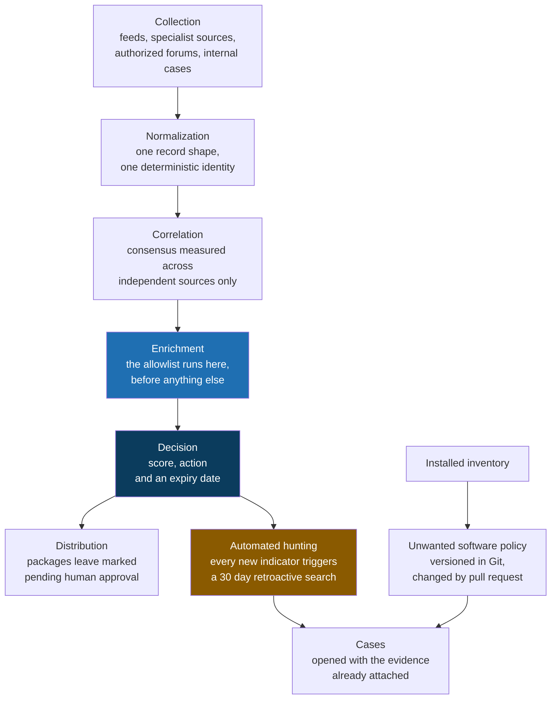

# IOC, PUA and Automated Hunting

**A unified open source platform for indicator management, unwanted software policy and retroactive threat hunting.**

[Leia em português](README.pt-BR.md)

> An indicator with no expiry date is not protection. It is debt, and sooner or later it pays interest as an availability incident.

This is the public preview of a project I built to settle a question that kept coming back to me: why do we treat a threat indicator as if it were true forever? A blocklist grows every week and almost never shrinks. Nobody removes anything, because removing feels risky and keeping feels free. It is not free. It just sends the bill later, to a different team.

So I designed the whole thing around the opposite assumption. Every indicator arrives with an expiry date, has to earn its place through agreement between independent sources, and gets checked against the legitimate infrastructure list before anything else happens to it. On top of that, the platform answers the question I actually care about when something new shows up: has this already happened here?

## The problem

Three problems, really, and I put them in one pipeline because they share the same spine.

**The blocklist nobody prunes.** A command and control address published in 2023 and still blocked today is not protecting anyone. At some point that address gets reassigned to a legitimate service, the block takes something down, and nobody connects the outage back to a list written two years earlier. I have seen enough of those to want expiry built into the data model rather than into someone's calendar reminder.

**Blocking yourself.** This is the most expensive false positive on this kind of platform. An indicator points at shared hosting, a CDN edge, a public resolver or a domain the business itself uses, it goes into the list, and a security decision turns into a network incident with people on the phone. The fix is not a smarter model, it is an ordering rule: the legitimate infrastructure list runs before any scoring at all.

**Unwanted software is not a detection problem.** Finding a torrent client or a remote access tool on a machine is trivial. The hard part is answering who authorized it, what the company tolerates, who signs the exception and when that exception expires. Without those answers written down somewhere durable, detection produces a list that everyone learns to ignore.

And under all three, the one that bothered me most: blocking the future without looking at the past. Putting a new indicator on a blocklist protects against the next attempt. It says nothing about whether the thing already walked in last month.

## The core idea

Five rules carry the design. Each one has code behind it, not a paragraph of good intentions.

**No indicator blocks on its own.** It needs two independent sources, or one very high confidence source with supporting context. The word doing the work there is *independent*: two feeds that repackage the same upstream are one source, not two, and counting them twice is a way of lying to yourself with arithmetic. Sources are grouped so that cannot happen.

**The allowlist comes before the blocklist.** Legitimate infrastructure is checked first, ahead of scoring, ahead of any judgment. An indicator that lands there leaves the blocking flow immediately, and nothing downstream can pull it back in.

**Everything expires.** Each indicator is born with a time to live and a decay curve, and the type sets the pace. A file hash ages slowly, because a hash is a fact about a file. An IP address ages fast, because an address is a lease and not a property.

**Every new indicator hunts backwards.** When something arrives with enough confidence, it does not just become a block. It becomes an automatic search across the last thirty days of telemetry, and if that search finds anything, a case opens with the evidence already attached.

**Unwanted software is policy.** Classification lives in a versioned file and changes through pull request, never through a script decision. A script can tell you a tool is remote access software. It cannot tell you whether your support team is allowed to use it, and pretending otherwise is how you end up with a policy nobody agreed to.

## How it fits together

One detail in that diagram is deliberate and worth pointing at. Distribution writes packages marked *pending human approval*. Nothing reaches a control point on its own. The whole platform can be running perfectly and a single wrong block still takes down production, so the cost of waiting for a person is low and the cost of skipping one is an incident.

## Built with

| Purpose | Tools |
|---|---|
| Intelligence hub | MISP, OpenCTI |
| Analysis and enrichment | IntelOwl, RDAP and WHOIS, GeoLite2, CIRCL passive DNS, Tranco |
| Indicator feeds | abuse.ch family (ThreatFox, URLhaus, MalwareBazaar, Feodo Tracker), OpenPhish, PhishTank, Spamhaus DROP, Blocklist.de, Firehol |
| Hunting languages | KQL, Sigma, YARA, osquery |
| Detection and blocking | Suricata, Zeek, DNS RPZ, Wazuh, pfSense and OPNsense |
| Formats and frameworks | STIX 2.1, MISP core format, MITRE ATT&CK, NDJSON |
| Optional integration | Microsoft Defender XDR, Microsoft Sentinel, Intune |
| Runtime | Python, Docker Compose |

Everything in the core is open source. That was a constraint from the first sketch, not a preference discovered along the way.

## A few numbers

| | |
|---|---|
| Layers in the pipeline | 8 |
| Principles the design answers to | 8 |
| Architecture decisions recorded with their reasoning | 6 |
| Source families feeding collection | 4 |
| Hunting languages supported | 4 |
| Confidence levels an indicator can hold | 3 |
| Retroactive hunting window | 30 days |
| Expiry | per indicator type, with decay |

## What this preview is, and what it is not

**In here:** the design, the principles, the architecture, the decisions I made and the reasoning behind each one.

**Not in here:** source code, the step by step implementation guides, the architecture document, and any sample output. The full project lives in a separate private repository, in two builds: the base platform described here, and the Jev variant, where the triage verdict comes from closed typed questions with a calibrated confidence figure, composed in code rather than decided inside the model. The two exist side by side on purpose, so that one can be measured against the other on identical input.

There are no screenshots yet, and I would rather say that plainly than dress up something I have not run end to end for an audience. Sample runs with fictitious data are the next thing planned for this repository, and they will show up here when they exist.

## About

I am a cloud security consultant working with threat intelligence, security posture and detection engineering. I build these projects to think problems through properly, which for me means writing the design down until it survives being read by someone who was not in my head when I wrote it.

If you want to see the full content, the code, the guides or the architecture document, get in touch: [github.com/Alisson-P](https://github.com/Alisson-P)

## License

This preview is licensed under [Creative Commons Attribution NonCommercial NoDerivatives 4.0 International](https://creativecommons.org/licenses/by-nc-nd/4.0/) (CC BY-NC-ND 4.0).

It is content, not a code release. You may share it with attribution, for non commercial purposes, with no derivative works.

Alisson Pereira / [github.com/Alisson-P](https://github.com/Alisson-P)
