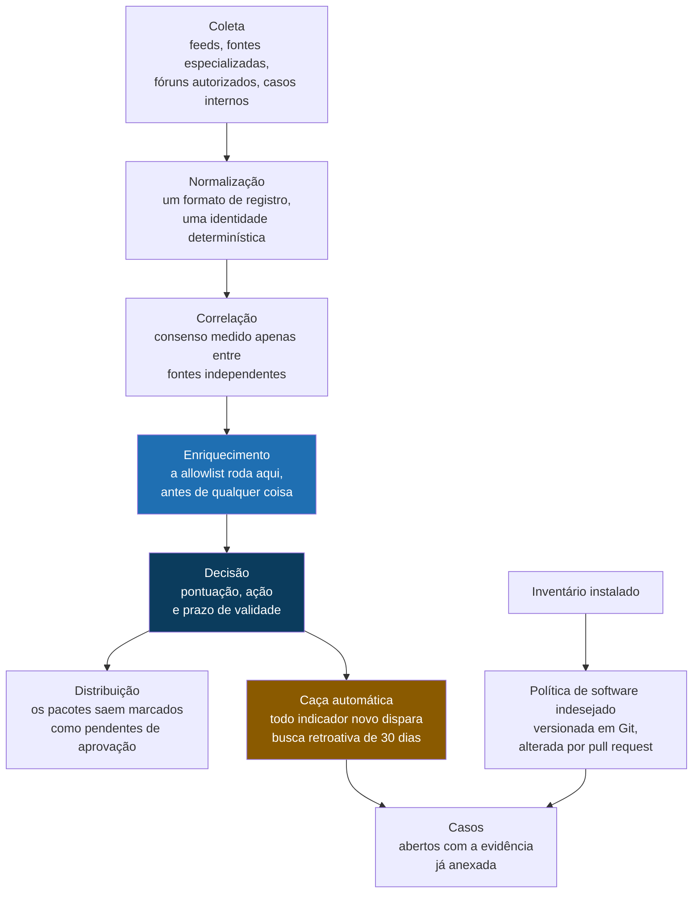

# IOC, PUA e Caça Automática

**Uma plataforma open source que unifica gestão de indicadores, política de software indesejado e caça retroativa a ameaças.**

[Read this in English](README.md) | [Variante com decisões tipadas](https://github.com/Alisson-P/ioc-pua-hunting-jev)

> Um indicador sem prazo de validade não é proteção. É dívida, e mais cedo ou mais tarde ela cobra juros na forma de incidente de disponibilidade.

Esta é a prévia pública de um projeto que eu construí para resolver uma pergunta que não me largava: por que a gente trata um indicador de ameaça como se ele fosse verdadeiro para sempre? Uma blocklist cresce toda semana e quase nunca encolhe. Ninguém tira nada, porque tirar parece arriscado e manter parece de graça. Não é de graça. Só manda a conta depois, para outro time.

Então desenhei tudo pela premissa oposta. Todo indicador nasce com prazo, precisa merecer o lugar dele através da concordância entre fontes independentes, e passa pela lista de infraestrutura legítima antes que qualquer outra coisa aconteça com ele. Em cima disso, a plataforma responde a pergunta que de fato me interessa quando aparece algo novo: isso já entrou aqui?

## O problema

Três problemas, na verdade, e eu coloquei os três numa esteira só porque eles compartilham a mesma espinha.

**A blocklist que ninguém poda.** Um endereço de comando e controle publicado em 2023 e bloqueado até hoje não está protegendo ninguém. Em algum momento aquele endereço é realocado para um serviço legítimo, o bloqueio derruba alguma coisa, e ninguém liga a queda a uma lista escrita dois anos antes. Já vi isso vezes suficientes para querer o prazo dentro do modelo de dados, e não dentro do lembrete de alguém.

**Bloquear a si mesmo.** Esse é o falso positivo mais caro desse tipo de plataforma. O indicador aponta para hospedagem compartilhada, borda de CDN, resolvedor público ou um domínio que a própria empresa usa, entra na lista, e uma decisão de segurança vira incidente de rede com gente no telefone. O conserto não é um modelo mais esperto, é uma regra de ordem: a lista de infraestrutura legítima roda antes de qualquer pontuação.

**Software indesejado não é problema de detecção.** Achar um cliente de torrent ou uma ferramenta de acesso remoto numa máquina é trivial. O difícil é responder quem autorizou, o que a empresa tolera, quem assina a exceção e quando ela expira. Sem essas respostas escritas em algum lugar durável, a detecção produz uma lista que todo mundo aprende a ignorar.

E por baixo dos três, o que mais me incomodava: bloquear o futuro sem olhar o passado. Colocar um indicador novo na blocklist protege da próxima tentativa. Não diz nada sobre aquilo já ter entrado no mês passado.

## A ideia central

Cinco regras sustentam o desenho. Cada uma tem código atrás, não um parágrafo de boas intenções.

**Nenhum indicador bloqueia sozinho.** Precisa de duas fontes independentes, ou uma fonte de altíssima confiança com contexto que sustente. A palavra que trabalha ali é *independentes*: dois feeds que reempacotam a mesma origem são uma fonte, não duas, e contar as duas é mentir para si mesmo com aritmética. As fontes são agrupadas justamente para isso não acontecer.

**A allowlist vem antes da blocklist.** Infraestrutura legítima é verificada primeiro, antes da pontuação, antes de qualquer julgamento. Indicador que cai ali sai do fluxo de bloqueio na hora, e nada lá na frente consegue trazer ele de volta.

**Tudo expira.** Cada indicador nasce com prazo de validade e curva de decaimento, e o tipo define o ritmo. Hash de arquivo envelhece devagar, porque hash é um fato sobre um arquivo. Endereço IP envelhece rápido, porque endereço é aluguel e não propriedade.

**Todo indicador novo caça para trás.** Quando chega algo com confiança suficiente, ele não vira só bloqueio. Vira busca automática nos últimos trinta dias de telemetria, e se a busca achar alguma coisa, abre um caso com a evidência já anexada.

**Software indesejado é política.** A classificação mora num arquivo versionado e muda por pull request, nunca por decisão de script. Um script consegue dizer que uma ferramenta é de acesso remoto. Ele não consegue dizer se o seu time de suporte tem autorização para usar, e fingir que consegue é como se acaba com uma política que ninguém combinou.

## Como as peças se encaixam

Um detalhe desse diagrama é deliberado e vale apontar. A distribuição escreve pacotes marcados como *pendentes de aprovação humana*. Nada chega sozinho a um ponto de controle. A plataforma inteira pode estar funcionando perfeitamente e um único bloqueio errado ainda derruba produção, então o custo de esperar uma pessoa é baixo e o custo de pular ela é um incidente.

## Feito com

| Para que serve | Ferramentas |
|---|---|
| Hub de inteligência | MISP, OpenCTI |
| Análise e enriquecimento | IntelOwl, RDAP e WHOIS, GeoLite2, DNS passivo do CIRCL, Tranco |
| Feeds de indicadores | família abuse.ch (ThreatFox, URLhaus, MalwareBazaar, Feodo Tracker), OpenPhish, PhishTank, Spamhaus DROP, Blocklist.de, Firehol |
| Linguagens de caça | KQL, Sigma, YARA, osquery |
| Detecção e bloqueio | Suricata, Zeek, DNS RPZ, Wazuh, pfSense e OPNsense |
| Formatos e frameworks | STIX 2.1, formato MISP, MITRE ATT&CK, NDJSON |
| Integração opcional | Microsoft Defender XDR, Microsoft Sentinel, Intune |
| Execução | Python, Docker Compose |

Tudo que está no núcleo é open source. Isso foi restrição desde o primeiro rascunho, não preferência descoberta no caminho.

## Alguns números

| | |
|---|---|
| Camadas na esteira | 8 |
| Princípios que o desenho obedece | 8 |
| Decisões de arquitetura registradas com o porquê | 6 |
| Famílias de fonte alimentando a coleta | 4 |
| Linguagens de caça suportadas | 4 |
| Níveis de confiança que um indicador pode ter | 3 |
| Janela da caça retroativa | 30 dias |
| Validade | por tipo de indicador, com decaimento |

## O que esta prévia é, e o que ela não é

**Está aqui:** o desenho, os princípios, a arquitetura, as decisões que eu tomei e o raciocínio atrás de cada uma.

**Não está aqui:** código fonte, os guias de implementação passo a passo, o documento de arquitetura e qualquer amostra de saída. O projeto completo mora num repositório privado separado, em duas versões: a plataforma base descrita aqui, e a variante Jev, em que o veredito da triagem sai de perguntas fechadas e tipadas, com um número de confiança calibrado, composto em código em vez de decidido dentro do modelo. As duas existem lado a lado de propósito, para que uma possa ser medida contra a outra sobre a mesma entrada.

Ainda não tem captura de tela, e eu prefiro dizer isso na lata a maquiar alguma coisa que eu não rodei de ponta a ponta para mostrar. Execuções de exemplo com dados fictícios são o próximo passo previsto para este repositório, e vão aparecer aqui quando existirem.

## Sobre

Sou consultor de segurança em nuvem e trabalho com inteligência de ameaças, postura de segurança e engenharia de detecção. Construo esses projetos para pensar os problemas direito, o que para mim significa escrever o desenho até ele sobreviver a ser lido por alguém que não estava na minha cabeça quando eu escrevi.

Se você quiser ver o conteúdo completo, o código, os guias ou o documento de arquitetura, me chame: [github.com/Alisson-P](https://github.com/Alisson-P)

## Licença

Esta prévia está sob a licença [Creative Commons Atribuição NãoComercial SemDerivações 4.0 Internacional](https://creativecommons.org/licenses/by-nc-nd/4.0/deed.pt-br) (CC BY-NC-ND 4.0).

Ela é conteúdo, não uma liberação de código. Você pode compartilhar com atribuição, para fins não comerciais, sem obras derivadas.

Alisson Pereira / [github.com/Alisson-P](https://github.com/Alisson-P)
